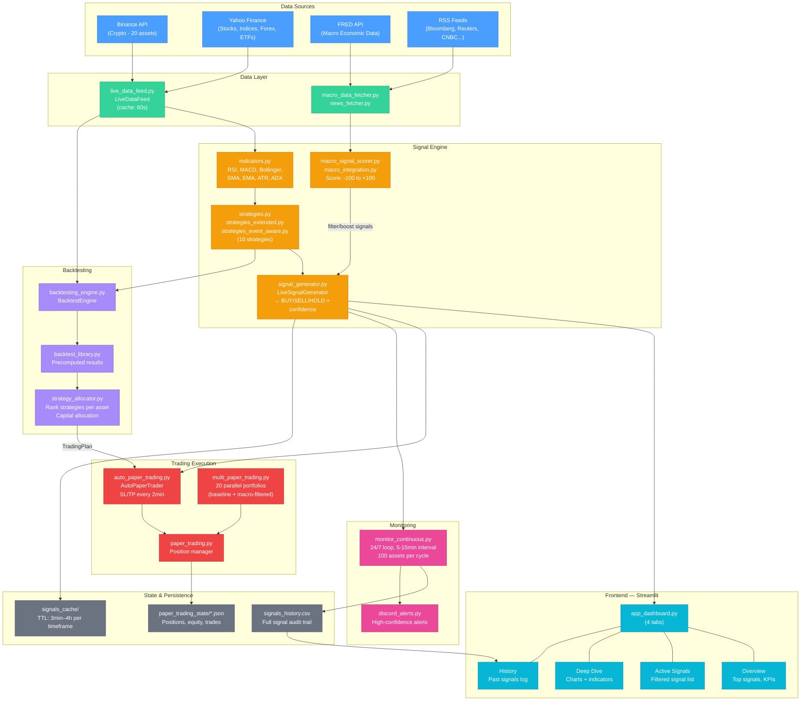
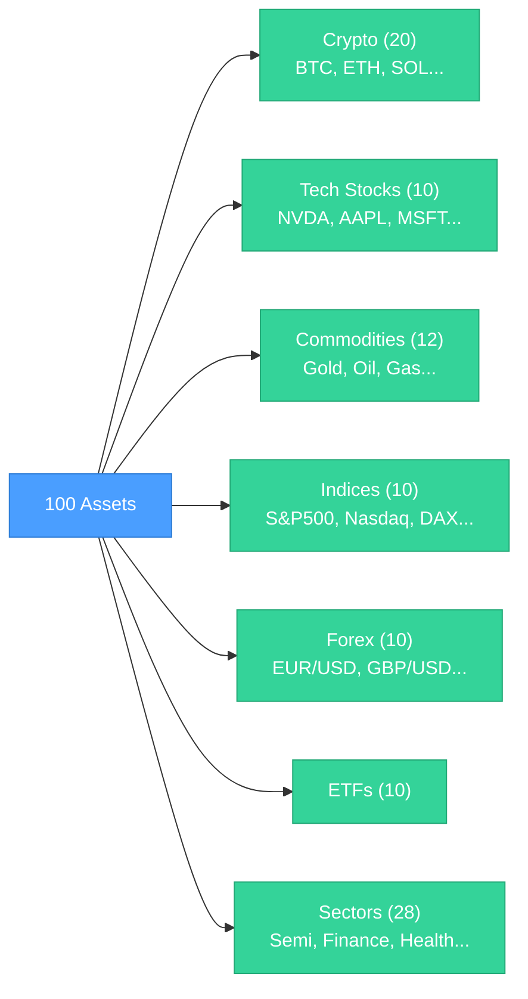
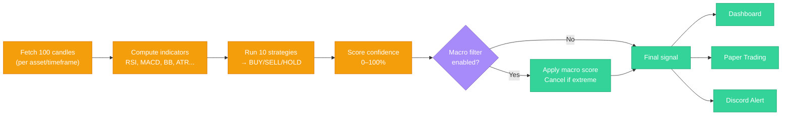
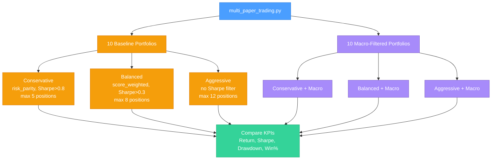

# Architecture

## System Overview

```mermaid
graph TB
    subgraph DataSources["Data Sources"]
        BINANCE["Binance API<br/>(Crypto - 20 assets)"]
        YAHOO["Yahoo Finance<br/>(Stocks, Indices, Forex, ETFs)"]
        FRED["FRED API<br/>(Macro Economic Data)"]
        RSS["RSS Feeds<br/>(Bloomberg, Reuters, CNBC...)"]
    end

    subgraph DataLayer["Data Layer"]
        LDF["live_data_feed.py<br/>LiveDataFeed<br/>(cache: 60s)"]
        MDF["macro_data_fetcher.py<br/>news_fetcher.py"]
    end

    subgraph SignalEngine["Signal Engine"]
        IND["indicators.py<br/>RSI, MACD, Bollinger,<br/>SMA, EMA, ATR, ADX"]
        STRAT["strategies.py<br/>strategies_extended.py<br/>strategies_event_aware.py<br/>(10 strategies)"]
        SG["signal_generator.py<br/>LiveSignalGenerator<br/>→ BUY/SELL/HOLD + confidence"]
        MSS["macro_signal_scorer.py<br/>macro_integration.py<br/>Score: -100 to +100"]
    end

    subgraph Backtesting["Backtesting"]
        BE["backtesting_engine.py<br/>BacktestEngine"]
        BL["backtest_library.py<br/>Precomputed results"]
        SA["strategy_allocator.py<br/>Rank strategies per asset<br/>Capital allocation"]
    end

    subgraph Execution["Trading Execution"]
        APT["auto_paper_trading.py<br/>AutoPaperTrader<br/>SL/TP every 2min"]
        MPT["multi_paper_trading.py<br/>20 parallel portfolios<br/>(baseline + macro-filtered)"]
        PT["paper_trading.py<br/>Position manager"]
    end

    subgraph Frontend["Frontend — Streamlit"]
        DASH["app_dashboard.py<br/>(4 tabs)"]
        TAB1["Overview<br/>Top signals, KPIs"]
        TAB2["Active Signals<br/>Filtered signal list"]
        TAB3["Deep Dive<br/>Charts + indicators"]
        TAB4["History<br/>Past signals log"]
    end

    subgraph Monitoring["Monitoring"]
        MON["monitor_continuous.py<br/>24/7 loop, 5-15min interval<br/>100 assets per cycle"]
        DISC["discord_alerts.py<br/>High-confidence alerts"]
    end

    subgraph State["State & Persistence"]
        JSON["paper_trading_state/*.json<br/>Positions, equity, trades"]
        CSV["signals_history.csv<br/>Full signal audit trail"]
        CACHE["signals_cache/<br/>TTL: 3min–4h per timeframe"]
    end

    %% Data flow
    BINANCE --> LDF
    YAHOO --> LDF
    FRED --> MDF
    RSS --> MDF

    LDF --> IND
    IND --> STRAT
    STRAT --> SG
    MDF --> MSS
    MSS -->|"filter/boost signals"| SG

    LDF --> BE
    STRAT --> BE
    BE --> BL
    BL --> SA
    SA -->|"TradingPlan"| APT

    SG --> DASH
    SG --> APT
    SG --> MON

    APT --> PT
    MPT --> PT
    PT --> JSON

    MON --> CSV
    MON --> DISC
    SG --> CACHE

    DASH --- TAB1
    DASH --- TAB2
    DASH --- TAB3
    DASH --- TAB4
    CSV --> TAB4

    %% Styling
    classDef source fill:#4a9eff,stroke:#2d7cd6,color:#fff
    classDef data fill:#34d399,stroke:#22a876,color:#fff
    classDef signal fill:#f59e0b,stroke:#d97706,color:#fff
    classDef backtest fill:#a78bfa,stroke:#7c5cbf,color:#fff
    classDef exec fill:#ef4444,stroke:#c42b2b,color:#fff
    classDef ui fill:#06b6d4,stroke:#0891b2,color:#fff
    classDef monitor fill:#ec4899,stroke:#c22677,color:#fff
    classDef state fill:#6b7280,stroke:#4b5563,color:#fff

    class BINANCE,YAHOO,FRED,RSS source
    class LDF,MDF data
    class IND,STRAT,SG,MSS signal
    class BE,BL,SA backtest
    class APT,MPT,PT exec
    class DASH,TAB1,TAB2,TAB3,TAB4 ui
    class MON,DISC monitor
    class JSON,CSV,CACHE state
```

## Asset Coverage (100 assets)

```mermaid
graph LR
    ASSETS["100 Assets"] --> CRYPTO["Crypto (20)<br/>BTC, ETH, SOL..."]
    ASSETS --> STOCKS["Tech Stocks (10)<br/>NVDA, AAPL, MSFT..."]
    ASSETS --> COMMOD["Commodities (12)<br/>Gold, Oil, Gas..."]
    ASSETS --> INDEX["Indices (10)<br/>S&P500, Nasdaq, DAX..."]
    ASSETS --> FOREX["Forex (10)<br/>EUR/USD, GBP/USD..."]
    ASSETS --> ETFS["ETFs (10)"]
    ASSETS --> SECTORS["Sectors (28)<br/>Semi, Finance, Health..."]

    classDef root fill:#4a9eff,stroke:#2d7cd6,color:#fff
    classDef cat fill:#34d399,stroke:#22a876,color:#fff
    class ASSETS root
    class CRYPTO,STOCKS,COMMOD,INDEX,FOREX,ETFS,SECTORS cat
```

## Signal Generation Pipeline

```mermaid
flowchart LR
    A["Fetch 100 candles<br/>(per asset/timeframe)"] --> B["Compute indicators<br/>RSI, MACD, BB, ATR..."]
    B --> C["Run 10 strategies<br/>→ BUY/SELL/HOLD"]
    C --> D["Score confidence<br/>0–100%"]
    D --> E{"Macro filter<br/>enabled?"}
    E -->|Yes| F["Apply macro score<br/>Cancel if extreme"]
    E -->|No| G["Final signal"]
    F --> G

    G --> H["Dashboard"]
    G --> I["Paper Trading"]
    G --> J["Discord Alert"]

    classDef step fill:#f59e0b,stroke:#d97706,color:#fff
    classDef decision fill:#a78bfa,stroke:#7c5cbf,color:#fff
    classDef output fill:#34d399,stroke:#22a876,color:#fff
    class A,B,C,D step
    class E decision
    class F,G,H,I,J output
```

## Multi-Portfolio Comparison

```mermaid
graph TB
    MPT["multi_paper_trading.py"] --> BL["10 Baseline Portfolios"]
    MPT --> MF["10 Macro-Filtered Portfolios"]

    BL --> C1["Conservative<br/>risk_parity, Sharpe>0.8<br/>max 5 positions"]
    BL --> C2["Balanced<br/>score_weighted, Sharpe>0.3<br/>max 8 positions"]
    BL --> C3["Aggressive<br/>no Sharpe filter<br/>max 12 positions"]

    MF --> M1["Conservative + Macro"]
    MF --> M2["Balanced + Macro"]
    MF --> M3["Aggressive + Macro"]

    C1 & C2 & C3 & M1 & M2 & M3 --> COMPARE["Compare KPIs<br/>Return, Sharpe, Drawdown, Win%"]

    classDef root fill:#4a9eff,stroke:#2d7cd6,color:#fff
    classDef base fill:#f59e0b,stroke:#d97706,color:#fff
    classDef macro fill:#a78bfa,stroke:#7c5cbf,color:#fff
    classDef result fill:#34d399,stroke:#22a876,color:#fff
    class MPT root
    class BL,C1,C2,C3 base
    class MF,M1,M2,M3 macro
    class COMPARE result
```
